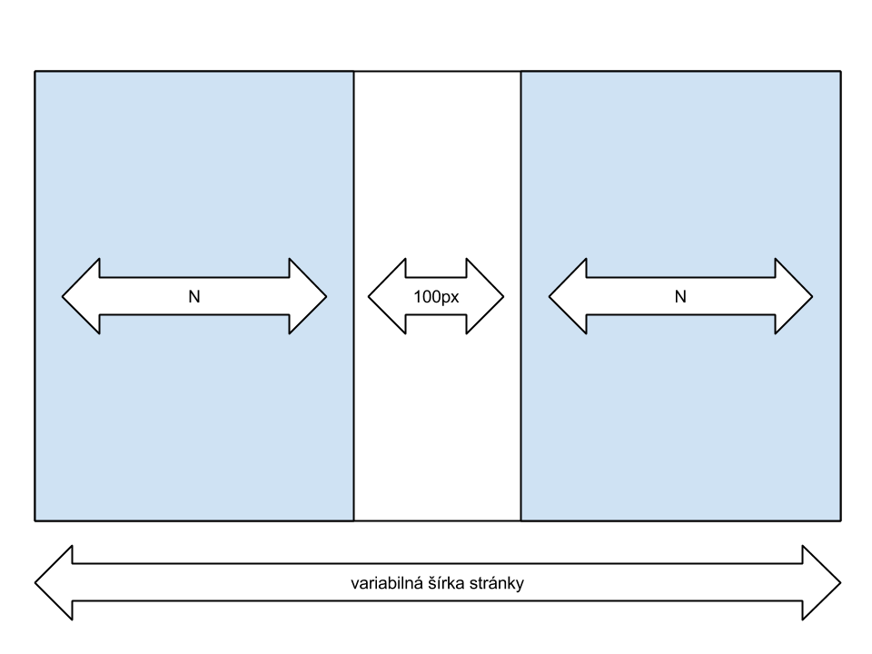

# Kóderské testy

Toto je zoznam úloh, ktoré dávam kóderom na prijímacích pohovoroch.

Väčšina týchto úloh **nemá konkrétne jediné správne riešenie**. Slúžia skôr na to, aby uchádzač mohol predviesť, čo všetko vie, ako uvažuje, akým spôsobom rieši problémy a či si tie problémy vôbec uvedomí.

Od uchádzačov nevyžadujem, aby mali akademické znalosti a nabifľované špecifikácie. Nechcem po nich ani, aby písali konkrétny kód. O úlohách sa iba bavíme, ak píšeme nejaký kód, tak mi stačí pseudokód na papieri. Ak chcú, majú prístup k internetu, môžu Googliť, čítať dokumentácie, chatovať s kamarátmi, čokoľvek.

## HTML + CSS

### CSS selectory

Akú farbu by mal text odstavca v tejto ukážke?

```html
  <p id="myId" class="myClass">text</p>
  <style>
    #myId         {color: red;}
    .myClass#myId {color: green;}
    p             {color: blue}
    p.myClass     {color: yellow;}
    p             {color: gray !important;}
    .myClass      {color: orange;}
  </style>
```

Táto úloha má otestovať, či uchádzač má povedomie o [špecificite CSS selectorov](https://developer.mozilla.org/en-US/docs/Web/CSS/Specificity). Nejde mi o to, aby zo seba vysypal presné pravidlá. Stačí mi, ak bude mať povedomie o tom, ako to funguje. Že ID selector asi bude mať vyššiu váhu než type (tag) selector. A že `!important` to všetko prebije.

Diskusia:

* Skús zoradiť selectory podľa ich váhy.
* Aký selector by som musel napísať, aby som zmenil farbu textu?

### Responzívny design

Chcem nakódovať layout roztiahnutý na celú šírku stránky. Šírka stránky sa môže meniť, nie je pevne daná. Layout bude obsahovať dva stĺpce. Obidva budú mať rovnakú šírku. Medzi nimi bude medzera, ktorá bude mať vždy šírku 100px, bez ohľadu na šírku stránky. Viď schéma



Pri tejto úlohe v prvom rade sledujem, či uchádzačovi vôbec dôjde, v čom je skutočný problém takéhoto zadania:

* Juniori sa obvykle zamerajú na floating (popisujú mi, ako nafloatujú stĺpce doľava a doprava a že potom budú musieť floating resetovať).
* Seniori si obvykle všimnú **skutočný problém**: mixovanie relatívnych a absolútnych jednotiek - stĺpce musia mať širku zadanú v `%`, ale medzera musí byť v `px`.

Riešení je spústa. Napríklad:

* [pre moderné browsery, pomocou `box-sizing`](http://jsfiddle.net/fczbkk/VByJ2/2/)
* [pre staršie browsery, pomocou wrapperu](http://jsfiddle.net/fczbkk/p4mxL/)
* [pre staršie browsery, pomocou negatívneho marginu](http://jsfiddle.net/fczbkk/N4tda/) (hat tip [Tomáš Hrabinský](https://www.linkedin.com/in/tomashrabinsky))
* [pre budúce browsery, pomocou `calc`](http://jsfiddle.net/N4tda/1/) (hat tip [Jan Šablatura](https://www.facebook.com/jan.sablatura))

Je zaujímavé sledovať, či uchádzači hľadajú elegantné riešenie alebo sa to snažia nahackovať, či používajú moderné CSS (`box-sizing`) alebo sa snažia riešiť kompatibilitu so starými prehliadačmi (každý stĺpec je v dvoch DIVoch, vonkajší definuje šírku a vnútorný definuje padding). Kľudne beriem aj riešenie pomocou tabuliek alebo JavaScriptu.

Diskusia (ak si uchádzač nevie rady):

* Je podľa teba vôbec možné takýto layout dosiahnuť? Ak nie, ako by si upravil zadanie tak, aby bolo realizovateľné, ale pritom čo najbližšie pôvodnému zadaniu?

## JavaScript

### Čítanie kódu, práca s DOM

Uchádzačovi ukážem nasledujúci kód.

```javascript
  root = document.getElementById('myElement');
  paragraphs = root.getElementsByTagName('p');
  for (i = 0; i < paragraphs.length; i++) {
    root.removeChild(paragraphs[i]);
  }
```

Potom sa s ním postupne bavím o týchto veciach:

**Čo chcel autor kódu dosiahnuť?**

Uchádzač by mal pochopiť, že kód má odstrániť všetky odstavce (`P`) z elementu s ID `myElement`.

**Bude tento kód fungovať? Ak nie, aké problémy v ňom vidíš a ako by si ich riešil?**

Kód v ukážke je prešpikovaný chybami. Zaujíma ma, čo všetko si užívateľ všimne. Niektoré problémy sú zjavné, iné vyžadujú intímnu znalosť manipulácie s DOM pomocou JS. Pri tejto úlohe sa pekne ukáže úroveň uchádzačových znalostí.

* Ani jedna premenná (`root`, `paragraphs`, `i`) nie je zadefinovaná ako premenná (`var`).
* Ak odstavec nebude priamy potomok root elementu (napr. `#myElement > div > p`), tak `removeChild` nezafunguje.
* Cyklus je neefektívny, pretože pri každom prechode znova a znova zisťuje dĺžku premennej `paragraphs`.
* `getElementsByTagName` vracia živú zbierku. Odstránenie elementu zmení obsah a dĺžku výsledku. Takže tento kód by prinajlepšom odstránil každý druhý element.

**Ako by si tento kód prepísal aby fungoval? Napadá ťa vhodnejšie riešenie problému?**

`getElementsByTagName` vracia **živú zbierku**. Aby kód v tejto podobe fungoval, musela by sa zbierka odstavcov prechádzať odzadu a elementy by sa museli odstraňovať zo skutočného rodiča:

```javascript
  var root = document.getElementById('myElement');
  var paragraphs = root.getElementsByTagName('p');
  for (var i = paragraphs.length; i >= 0; --i) {
    paragraphs[i].parentNode.removeChild(paragraphs[i]);
  }
```

Odstraňovanie elementov zo živej zbierky sa dá urobiť efektívnejšie pomocou `while` cyklu:

```javascript
  while (paragraph = paragraphs[0]) {
    paragraph.parentNode.removeChild(paragraph);
  }
```

Výber elementov sa v moderných browseroch dá urobiť oveľa efektívnejšie pomocou `querySelectorAll`, čo vracia **mŕtvu zbierku**:

```javascript
  var paragraphs = document.querySelectorAll('#myElement p');
```

Od juniorov kľudne beriem aj riešenie pomocou Jquery:

```javascript
  $('#myElement p').remove()
```

### Eventy a optimalizácia kódu

Mám stránku, ktorá obsahuje odrážkový zoznam s odkazmi. Chcem, aby sa po kliknutí na ľubovoľný odkaz zobrazil alert s URLkou toho odkazu. Ako to dosiahnem?

```html
  <ul>
    <li><a href="http://google.com">Google</a></li>
    <li><a href="http://microsoft.com">Microsoft</a></li>
    <li><a href="http://apple.com">Apple</a></li>
  </ul>
```

Najprimitívnejšie možné riešenie:

```html
  <a href="http://google.com" onclick="alert(this.href);">Google</a>
```

Od uchádzača očakávam, že zvládne zavesiť a spracovať jednoduchý click event. Je mi celkom jedno, či použije vanilla JS alebo Jquery:

```javascript
  $('a').on('click', function (event) {
    alert(event.target.href);
  });
```

Ak použije vanilla JS, urobí na mňa dobrý dojem, ak uchádzač aspoň zmieni (v ideálnom prípade bude schopný vyriešiť) problém s rozdielnosťou v zavesení eventu v IE (`attachEvent`) a ostatných browseroch (`addEventListener`).

```javascript
  function addEvent(obj, evt, callback) {
    if (obj.addEventListener) {
      obj.addEventListener(evt, callback);
    } else if (obj.attachEvent) {
      obj.attachEvent('on' + evt, callback);
    }
  }
```

Uchádzač by nemal mať problém získať `href` atribút elementu a poslať ho do alertu.

Väčšina uchádzačov zavesí click event na každý odkaz zvlášť. V takom prípade sa ich v následnej diskusii opýtam, **či by postupovali inak, keby tých odkazov na stránke bolo 10.000?** Juniorní uchádzači by si mali uvedomiť, že zavesenie 10k eventov spôsobí problém s výkonom. Seniorní uchádzači by mali byť schopní prísť s riešením (napr. zavesiť event listener na odrážkový zoznam a po kliknutí sa z targetu eventu dopracovať k odkazu).
